# 🌐 Projeto GlobalSolution - Sistema de Gestão de Ajuda em Desastres Naturais

## 👨‍💻 Desenvolvido por

* Eduardo Guilherme Dias (RM 557886) - 2TDSPV
* Gabriel Alves Thomaz (RM 558637) - 2TDSPV
* Luiz Sadao Kamada (RM 557652) - 2TDSPV
  
---

## 🧭 Introdução

Com o aumento dos desastres naturais como alagamentos, deslizamentos e enchentes, é essencial ter uma plataforma que organize a resposta comunitária e governamental. O projeto **GlobalSolution** propõe uma solução digital completa para gerenciar:

* Relatos da população
* Pedidos de socorro
* Cadastro e gerenciamento de abrigos
* Coordenação de voluntários e doações

A aplicação foi desenvolvida com **ASP.NET Core + Razor Pages**, conectada a um banco **Oracle** via **Entity Framework Core**, e expõe também endpoints RESTful documentados com **Swagger**.

---

## ✅ Como utilizar este projeto

### Passo a passo para rodar localmente:

1. **Clone o repositório**:

```bash
git clone https://github.com/luizkamada1/GlobalSolution-DotNet.git
cd globalsolution
```

2. **Configure a string de conexão Oracle no `Program.cs`**:

```csharp
options.UseOracle("User Id=SEU_USUARIO;Password=SUA_SENHA;Data Source=SEU_HOST:1521/SEU_SID");
```

3. **Restaure os pacotes NuGet**:

```bash
dotnet restore
```

4. **Crie o banco com as tabelas automaticamente**:

```bash
dotnet ef database update
```

5. **Execute o projeto**:

```bash
dotnet run
```

6. **Acesse no navegador**:

* Razor Pages: `https://localhost:7026/`
* Swagger: `https://localhost:7026/swagger`

> Certifique-se de que o Oracle esteja acessível e configurado corretamente.

---

## 📌 Tecnologias Utilizadas

* ASP.NET Core Razor Pages (CRUD completo)
* API RESTful com Swagger
* Entity Framework Core
* Oracle SQL Developer (banco relacional)
* JSON com `ReferenceHandler.IgnoreCycles`

---

## 🗃️ Modelagem do Banco de Dados (Oracle)

### 🔄 Diagrama Entidade-Relacionamento

```
USUARIO (1) <------ (N) RELATO
USUARIO (1) <------ (N) PEDIDO_AJUDA
USUARIO (1) <------ (1) VOLUNTARIO (1) ------> (N) DOACAO
USUARIO (1) <------ (N) USUARIO_ABRIGADO (N) ------> (1) ABRIGO
```
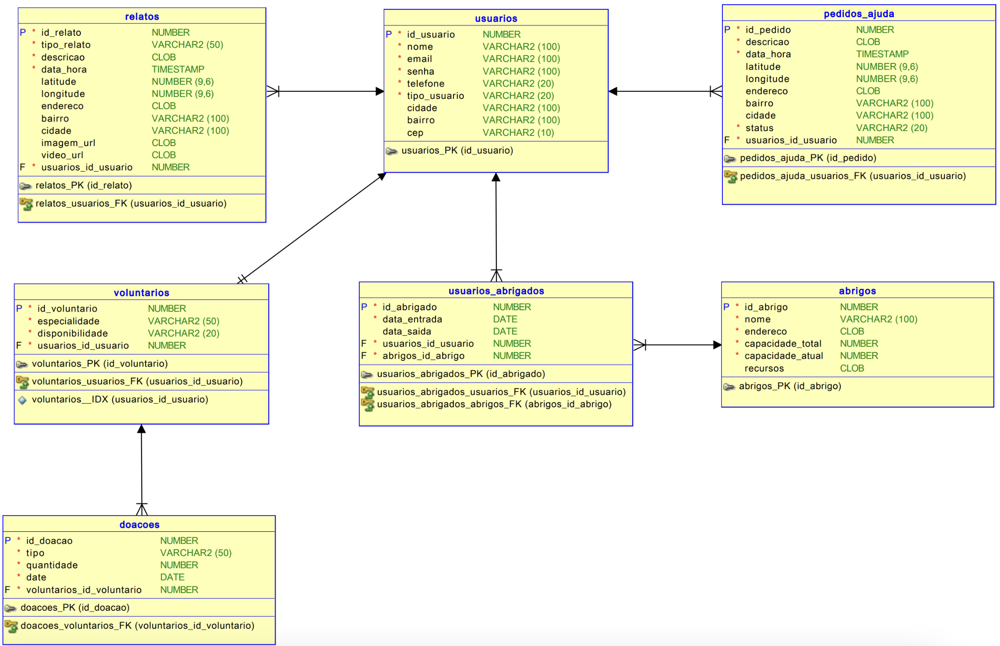
---

## 🛠️ Etapas de Desenvolvimento

### Etapa 1 - Modelagem das Entidades

* Criação dos models em `Models/`
* Anotações com `[Required]`, `[MaxLength]`, `[ForeignKey]`, `[ValidateNever]`

### Etapa 2 - Configuração do Oracle

* Criação de usuário e permissões no Oracle SQL Developer
* Ajuste do `appsettings.json` com string de conexão

```csharp
options.UseOracle("User Id=rm123456;Password=suasenha;Data Source=oracle.exemplo.com.br:1521/orcl");
```

### Etapa 3 - Geração de Migrations

```bash
dotnet ef migrations add InitialCreate
dotnet ef database update
```

### Etapa 4 - Criação das Razor Pages

* CRUD completo para cada entidade
* Separados em pastas por funcionalidade (`/Pages/Usuarios`, `/Pages/Relatos`, etc.)

### Etapa 5 - Exposição da API REST com Swagger

* `MapControllers()` no `Program.cs`
* Adicionado suporte a `ReferenceHandler.IgnoreCycles` para evitar loop entre objetos

```csharp
builder.Services.AddControllers().AddJsonOptions(options =>
{
    options.JsonSerializerOptions.ReferenceHandler = ReferenceHandler.IgnoreCycles;
});
```

### Etapa 6 - Testes

* Testes manuais via Razor Pages e Swagger
* Validações de integração com Oracle

---
## 🧪 Testando os Endpoints
## 🔌 Endpoints RESTful com Exemplos

## 📌 `POST /api/Usuarios`

```json
{
  "nome": "Ana Souza",
  "email": "ana@email.com",
  "senha": "123",
  "telefone": "(11)97602-0017",
  "tipoUsuario": "morador",
  "bairro": "Vila Mariana",
  "cidade": "São Paulo",
  "cep": "03731-000"
}

```
## `https://localhost:7026/swagger/Usuarios/Create`
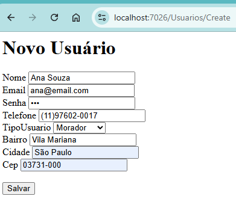

## `https://localhost:7026/swagger/Usuarios`
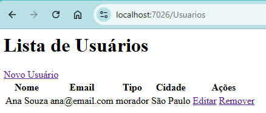

## `GET /api/Usuarios` via Swagger
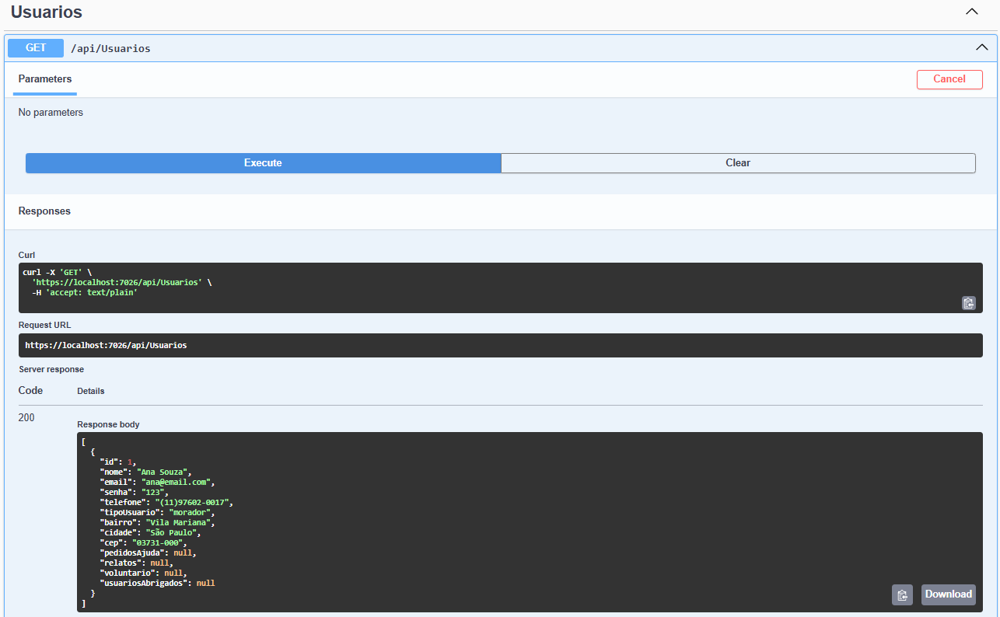
---

## 📌 `POST /api/Abrigos`

```json
{
  "nome": "Abrigo Central",
  "endereco": "Rua das Flores, 100",
  "capacidadeTotal": 100,
  "capacidadeAtual": 25,
  "recursos": "água, comida, energia"
}
```


## `https://localhost:7026/swagger/Abrigos/Create`
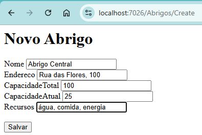

## `https://localhost:7026/swagger/Abrigos`
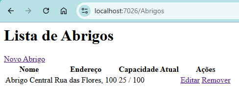

## `GET /api/Abrigos` via Swagger
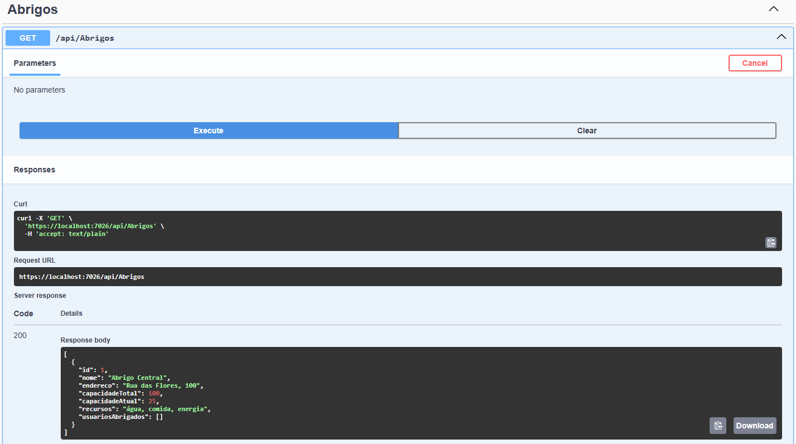
---

## 📌 `POST /api/Relatos`

```json
{
  "idUsuario": 1,
  "tipoRelato": "Alagamento",
  "descricao": "Rua alagada até a altura do joelho",
  "dataHora": "2025-06-06T14:00:00",
  "latitude": "-23.5502",
  "longitude": "-46.6333",
  "cidade": "São Paulo",
  "endereco": "Rua Alameda Santos 100",
  "bairro": "Jardins",
  "cidade": "São Paulo",
  "midiaUrl": "https://imgur.com/alagamento123"
}
```


## `https://localhost:7026/swagger/Relatos/Create`
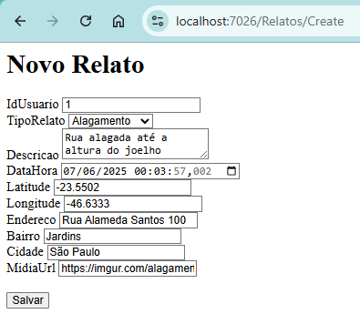

## `https://localhost:7026/swagger/Relatos`
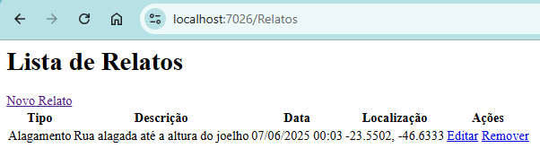

## `GET /api/Relatos` via Swagger
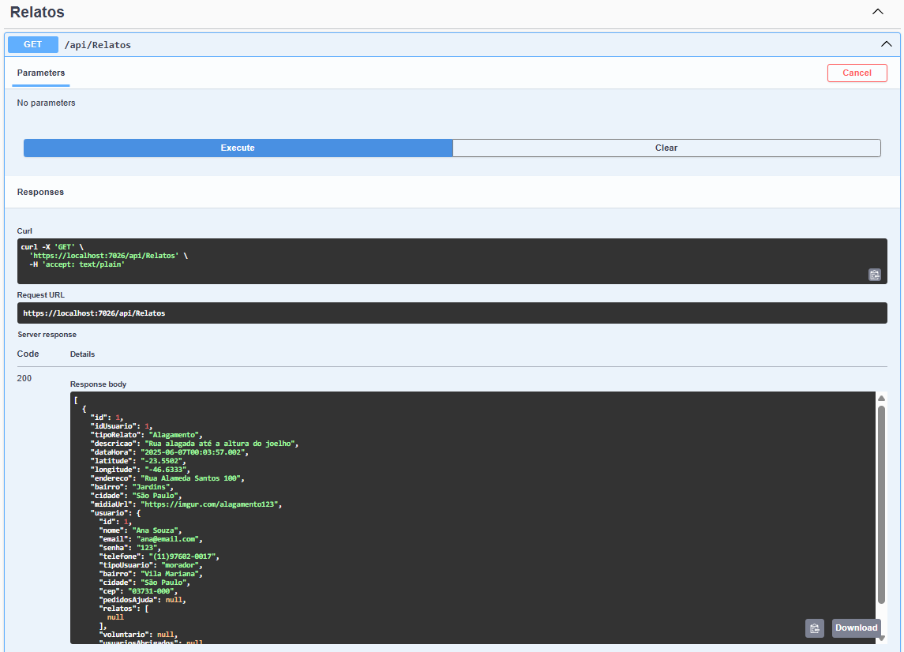
---

### 📌 `POST /api/PedidosAjuda`

```json
{
  "idUsuario": 1,
  "descricao": "Família isolada no telhado",
  "dataHora": "2025-06-06T15:30:00",
  "latitude": "-23.5502",
  "longitude": "-46.6333",
  "endereco": "Rua Francisco Damante 954",
  "bairro": "Vila Londrina",
  "cidade": "São Paulo",
  "status": "Em Andamento"
}
```


## `https://localhost:7026/swagger/PedidosAjuda/Create`
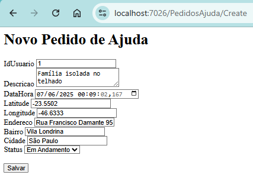

## `https://localhost:7026/swagger/PedidosAjuda`
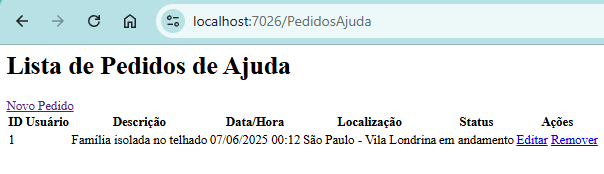

## `GET /api/PedidosAjuda` via Swagger

---


### 📌 `POST /api/Voluntarios`

```json
{
  "idUsuario": 1,
  "especialidade": "médico",
  "disponibilidade": "sim"
}
```

## `https://localhost:7026/swagger/Voluntarios/Create`


## `https://localhost:7026/swagger/Voluntarios`
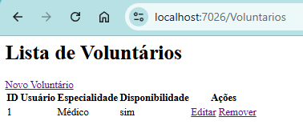

## `GET /api/Voluntarios` via Swagger
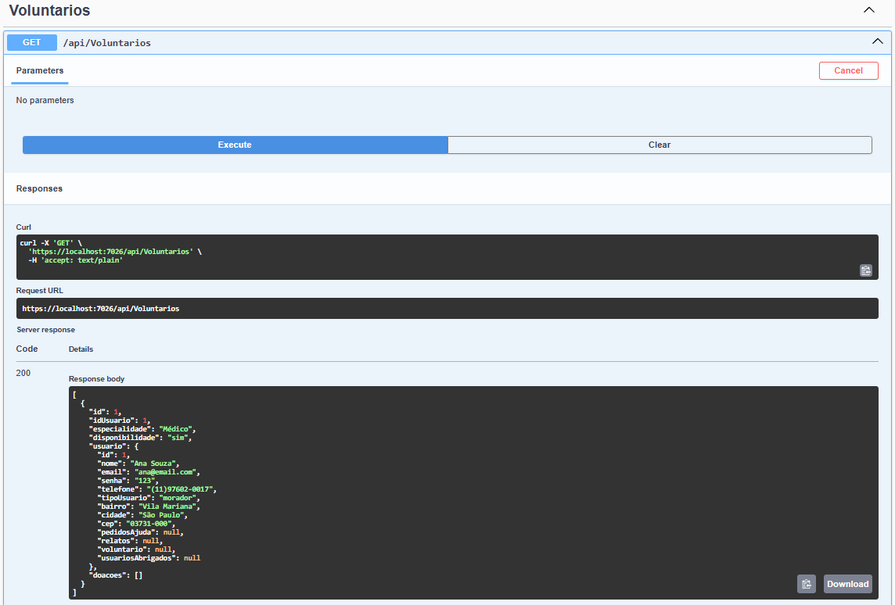
---

### 📌 `POST /api/UsuariosAbrigados`

```json
{
  "idUsuario": 1,
  "idAbrigo": 1,
  "dataEntrada": "2025-06-07",
  "dataSaida": "2025-06-12"
}
```


## `https://localhost:7026/swagger/UsuariosAbrigados/Create`
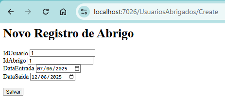

## `https://localhost:7026/swagger/UsuariosAbrigados`
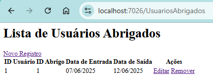

## `GET /api/UsuariosAbrigados` via Swagger
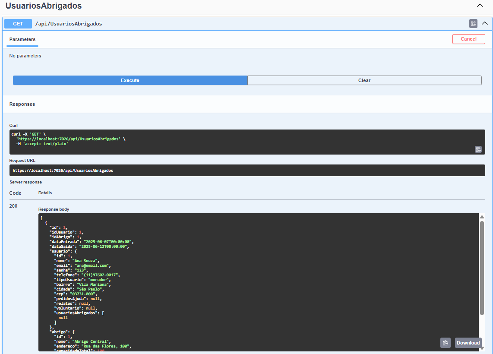
---

### 📌 `POST /api/Doacoes`

```json
{
  "idVoluntario": 1,
  "tipo": "alimento",
  "quantidade": 15,
  "data": "2025-06-07"
}
```

## `https://localhost:7026/swagger/Doacoes/Create`
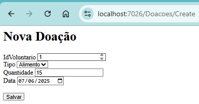

## `https://localhost:7026/swagger/Doacoes`
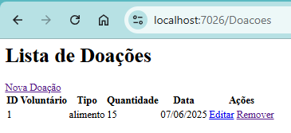

## `GET /api/Doacoes` via Swagger
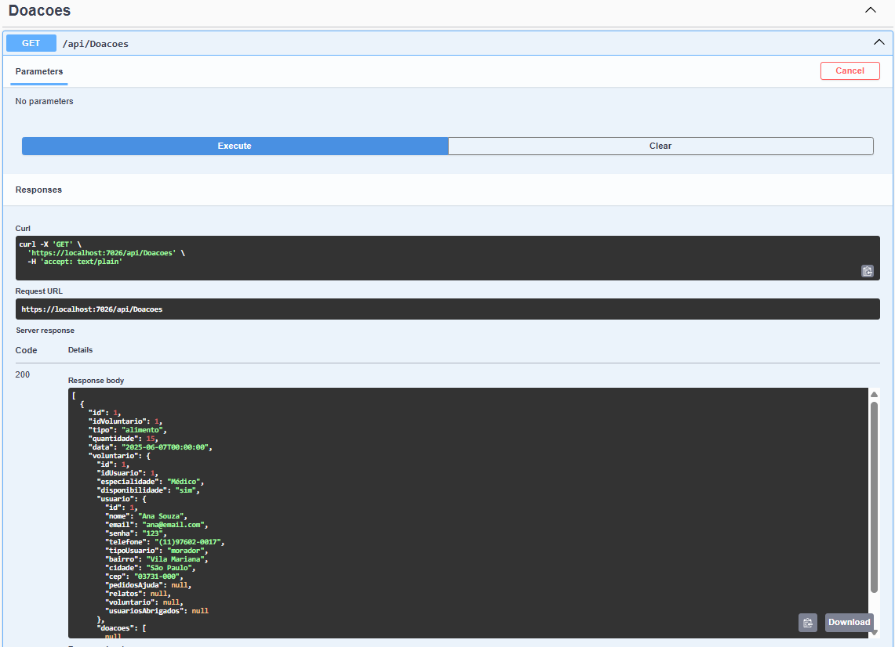

